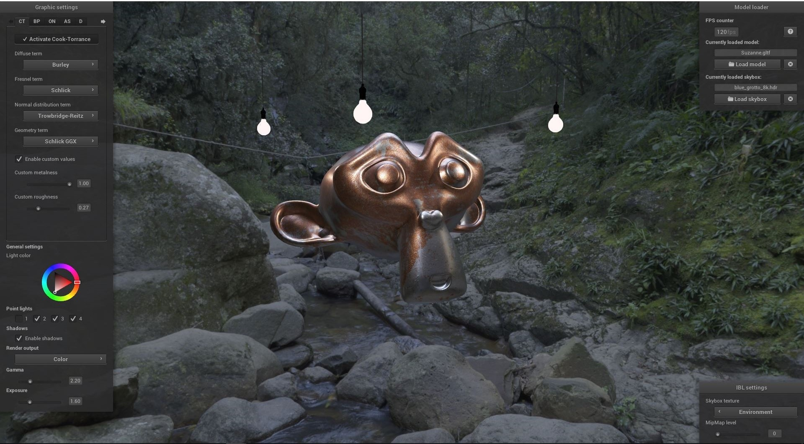

# PBRViewer

This is the repository containing the source code for PBRViewer, an application developed for the master thesis "A Comparison of phyiscally based Rendering Algorithms" by Daniel Schmitt.

The application allows to change the lighting parameters for physically based rendering algorithms in order to analyze their impact.
Currently, there are five models implemented:

* Cook-Torrance BRDF
* Blinn-Phong
* Oren-Nayar BRDF
* Ashikhmin-Shirley BRDF
* Disney BRDF

The application was developed under Windows 10 with Visual Studio 2017. At the moment, the application is executable under Windows only.  
For the future there are already considerations to port the application also for Linux and MacOS.  
OpenGL Version 4.3 or higher is required.

## Setup

1. Clone the repository including submodules:  
`git clone --recurse-submodules https://github.com/DanielSchmitt93/PBRViewer`
2. Execute `Setup.ps1` in order to extract the provided 3D models  
*If you get the error: "Running scripts is disabled on this system" please perform `set-executionpolicy remotesigned` in a powershell window with administrative rights.*
3. Load the solution file (.sln) with Visual Studio

## Quickstart

To get the setup from the image above, please follow these steps, after you have completed the setup:

1. Start the application
2. Load the model 'Suzanne' from `./resources/objects/Suzanne by deadalusmask/Suzanne.gltf`
3. Load the skybox `./resources/skybox/blue_grotto_8k.hdr`
4. Activate the lights in the graphic settings panel
5. Activate 'Enable custom values' in the options of the Cook-Torrance BRDF
6. Set the slider accordingly to the ones in the image

## Contact

For more information or further questions please contact the autor:  
schmittda62253@th-nuernberg.de *or*  
danielschmitt@t-online.de
